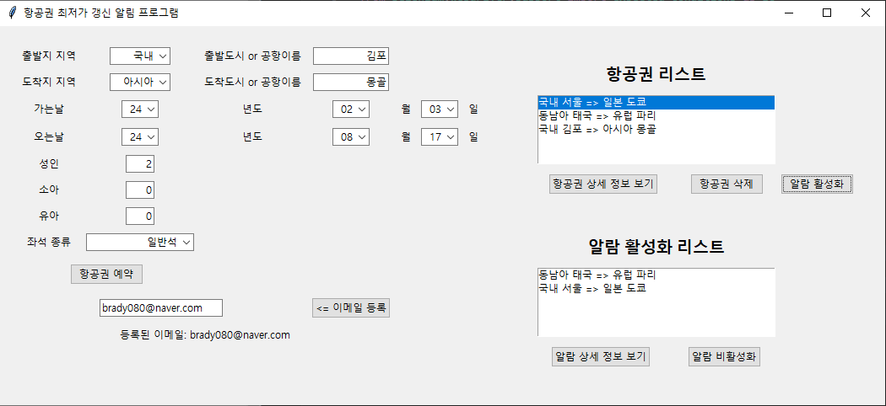
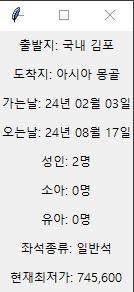
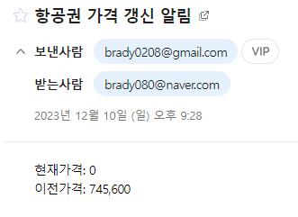

# Flight_Ticket_Alarm
## 프로그램 설명
0. **setting.txt파일을 설정합니다**
    - (구글 이메일, 구글 기기용 앱 비밀번호, 주기 설정)
1. **프로그램을 실행하고, 항공권 정보를 입력합니다**

    
3. **항공권 알람을 활성화 하면 최저가 정보를 받아옵니다**
4. **상세정보 보기 버튼을 눌러 현재 최저가를 확인합니다**

    
5. **이후로 설정한 주기마다 최저가 정보를 받아와 최저가가 갱신되면 메일을 보냅니다**

    
   
   (테스트를 위해 의도적으로 최저가를 0원으로 만들었더니 최저가가 갱신되어 메일이 수신된 사진)

## 항공권 예약 시스템을 위한 전제 조건
- 이 애플리케이션을 실행하기 위해서는 설치해야될 패키지: selenium

        pip install selenium 

    (파이썬이 설치되어 있을경우 위 명령어로 설치 가능합니다)

## 실행 환경
이 애플리케이션은 다음 환경에서 개발되고 테스트되었습니다:

- **Python 버전**: Python 3.12.0
- **운영 체제**: 윈도우10

## 크롬 드라이버
이 애플리케이션은 크롬 드라이버를 필요로 합니다. 

1. **크롬 버전 확인**

        chrome://version
    
    위 링크를 크롬 링크창에 입력후 접속하면 맨 윗줄에 버전 표시됩니다

2. **크롬 드라이버 다운로드**

   - 버전 114 이하: [여기서 다운로드](https://chromedriver.chromium.org/downloads)
   - 버전 115~119: [여기서 검색 후 링크 찾고 다운로드](https://googlechromelabs.github.io/chrome-for-testing/known-good-versions-with-downloads.json)
   - 
           [찾는 법]
           ex)크롭 버전 116.0.5802.?? 일때
           1. 링크에 들어가서 ctrl+f 로 116.0.5802 검색. 만약 없으면 116.0까지만 검색
           2. "크롬버전/운영체제/chromedriver-운영체제"가 포함된 형식의 링크들중에 자신의 운영체제가 들어간 링크로 다운로드
           3. 만약 여러개가 나오면, 116.0.5802.?? 중에서 ?? 은 아무거나 상관없고, 5802와 일치하는, 혹은 5802와 가까운 숫자의 링크로 다운로드
   - 버전 120 이상: [여기서 다운로드](https://googlechromelabs.github.io/chrome-for-testing/)

4. **크롬 드라이버 위치**
   - chromedriver.exe 파일을 filght_ticket_alarm.py 파일이 들어있는 디렉토리에 놓으십시오

## 설정 파일: setting.txt
1. **이메일 보낼 구글계정 입력**
   
           account_id = ""
           account_pasword = ""

    - account_id : 메일을 보낼 구글 계정의 이메일로 설정
    - account_password : !~~구글 계정의 비밀번호~~`가 아니고! [[**구글 기기용 앱 비밀번호**]] 를 생성 후 설정
    - [[**구글 기기용 앱 비밀번호**]] 생성하는법 : [https://googlechromelabs.github.io/chrome-for-testing/](https://kincoding.com/entry/Google-Gmail-SMTP-%EC%82%AC%EC%9A%A9%EC%9D%84-%EC%9C%84%ED%95%9C-%EC%84%B8%ED%8C%85)
      
2. **항공권 가격 체크 주기 입력**
   
           alarm_period = 1800

   (초 단위. 30으로 설정하면 30초마다 가격 체크, 1800으로 설정하면 30분마다 가격 체크)
   
3. **setting.txt 위치**
   - setting.txt 파일을 filght_ticket_alarm.py 파일이 들어있는 디렉토리에 놓으십시오

## 주의사항!
1. 크롬 창이 켜지고 항공권 검색중일때 조작시 오류 발생 가능성 있습니다
2. 출발 날짜와 도착 날짜는 [현재 날짜]~[1년후] 범위 내로 입력하셔야 최저가 검색이 올바르게 됩니다.
3. 메일을 보내는 메일계정은 구글계정만 가능합니다

